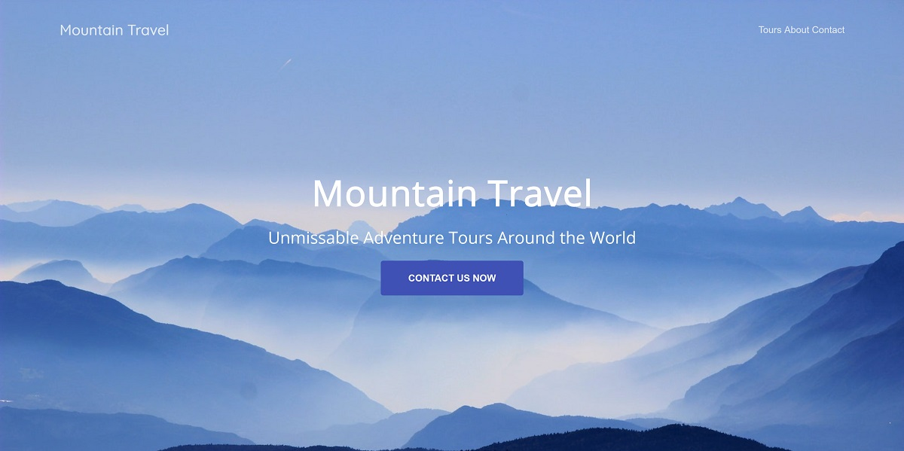

# Responsive Startup Site

### Description & Motivation

This is the first project on Colt Steele's [Advanced Web Developer Bootcamp](https://www.udemy.com/the-advanced-web-developer-bootcamp/learn/v4/content). In this section of the course I learned about CSS transitions and animations, and also helped solidify my Flexbox knowledge.

### Tech/framework used

Made with love and:

* HTML
* CSS
* CSS Animations
* Flexbox

### Live Demo

Live demo and code playground here: [https://codepen.io/mairamartinsk/pen/VQxbNv](https://codepen.io/mairamartinsk/pen/VQxbNv/?editors=1100#0)!

